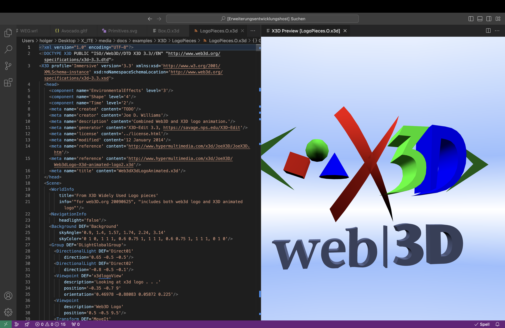
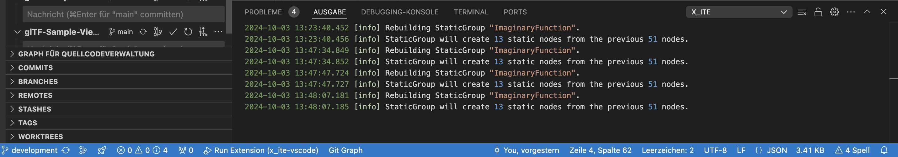

# X_ITE VS Code Extension

This extension integrates the [X_ITE X3D Browser](https://create3000.github.io/x_ite/) into VS Code.

## Preview and debug X3D, glTF, VRML and other 3D models directly in the editor.

Command name: `X3D: Preview 3D Model`, default key binding for Windows: <kbd>CTRL</kbd> + <kbd>ALT</kbd> + <kbd>X</kbd>, and for macOS: <kbd>COMMAND</kbd> + <kbd>OPTION</kbd> + <kbd>X</kbd>

The above model and other sample models can be obtained from the X_ITE [media](https://github.com/create3000/media/tree/main/docs/examples) repository.

With this extension you can preview 3D files in X_ITE. A new VS Code column is opened with the file preview.

## Supported File Formats

| Encoding         | File Extension | MIME Type       |
|------------------|----------------|-----------------|
| X3D XML          | .x3d, .x3dz    | model/x3d+xml   |
| X3D JSON         | .x3dj, .x3djz  | model/x3d+json  |
| X3D Classic VRML | .x3dv, .x3dvz  | model/x3d+vrml  |
| VRML             | .wrl, .wrz     | model/vrml      |
| glTF             | .gltf, .glb    | model/gltf+json |
| Wavefront OBJ    | .obj           | model/obj       |
| STL              | .stl           | model/stl       |
| PLY              | .ply           | model/ply       |
| SVG Document     | .svg, .svgz    | image/svg+xml   |

## Console Output

Console messages from the preview are redirected to the Output panel of VS Code when you switch to the 'X_ITE' channel.

## License

GPLv3, see [LICENSE.md](LICENSE.md).
